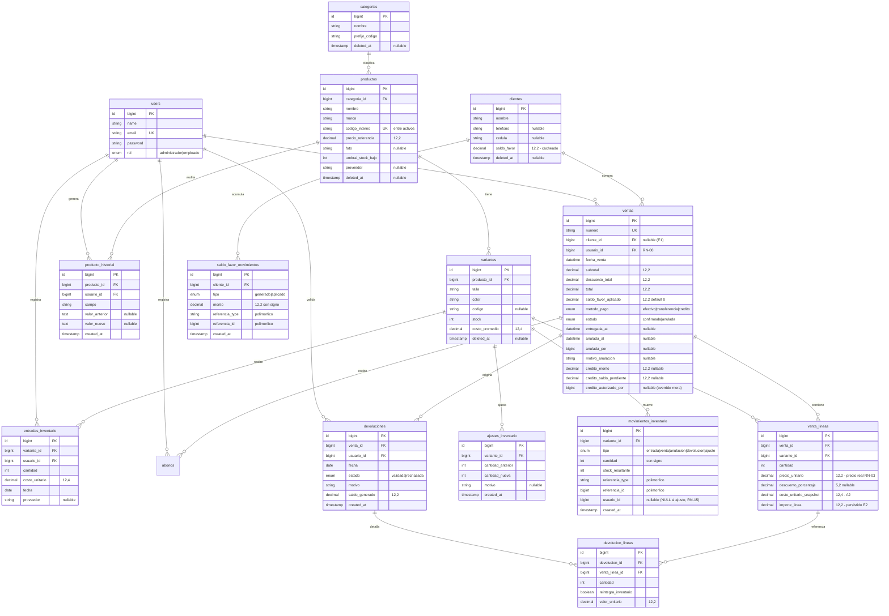

# Decisiones Técnicas — Sistema JP (Fase 3)

**Versión 1.0** — Agosto de 2026

> Documento de la Fase 3 del plan de proyecto. Registra las decisiones técnicas críticas
> que, según `CLAUDE.md`, deben quedar documentadas **antes** de implementar los módulos
> correspondientes.
>
> Estado de los bloques:
> - Bloque A · Modelo de dominio — **CERRADO**
> - Bloque B · Integridad — **CERRADO** (queda como tarea de implementación el índice UNIQUE de B2)
> - Bloque C · Dinero del cliente — **CERRADO**
> - Bloque E · Esqueleto de entidades + decisiones E1–E3 — **CERRADO**
> - Diagrama Entidad‑Relación — **incluido** (sección final)

---

## Bloque A — Modelo de dominio

### A1. Estrategia de costeo del inventario

**Decisión:** costo **promedio ponderado móvil** por variante, con **snapshot del costo en cada línea de venta**.

- Cada variante mantiene un campo `costo_promedio`.
- Al registrar una **entrada de mercancía** se recalcula:

  ```
  costo_promedio_nuevo = (stock_actual · costo_promedio_actual + cantidad_entrada · costo_unitario_entrada)
                         / (stock_actual + cantidad_entrada)
  ```

- Al **confirmar una venta**, el `costo_promedio` vigente de la variante se copia a la
  línea de venta (`venta_lineas.costo_unitario_snapshot`) y ya no cambia nunca.

**Alternativa descartada:** FIFO por lotes/capas de inventario. Da el costo exacto de la
unidad física vendida, pero exige una tabla de capas, lógica de consumo de capas y reparto
de devoluciones entre capas. Complejidad que no aporta valor al negocio real de JP (tienda
de ropa y calzado). El plan de proyecto ofrece "FIFO **o** costo promedio" como opciones
equivalentes.

**Reglas de negocio cubiertas:** RN‑04 (hay un costo claro atribuido a cada unidad vendida),
RN‑05 (ver A2).

### A2. Manejo del costo histórico por unidad

El costo vive en tres lugares, cada uno con una función distinta:

| Lugar | Campo | Cuándo cambia | Función |
|-------|-------|---------------|---------|
| `variantes` | `costo_promedio` (decimal) | En cada entrada de mercancía | Valorar inventario actual + alimentar el snapshot |
| `entradas_inventario` | `costo_unitario` (decimal) | Nunca (registro histórico) | Auditoría de compras y del recálculo |
| `venta_lineas` | `costo_unitario_snapshot` (decimal) | Nunca (se fija al confirmar la venta) | Calcular la ganancia de esa venta, de forma permanente |

**Fórmula de ganancia de una línea de venta (RN‑04):**

```
ganancia_linea = (precio_real_unitario − descuento_unitario) · cantidad
                 − costo_unitario_snapshot · cantidad
```

El resultado puede ser negativo (RN‑04 lo permite explícitamente).

**Consecuencia de RN‑05:** cambiar el costo de compra de un producto recalcula
`variantes.costo_promedio` para ventas futuras, pero **no modifica ninguna fila de
`venta_lineas` existente**. El historial de ganancias es inmutable por diseño, sin lógica
especial.

**Tipos monetarios:** todos los campos de dinero usan `decimal` (nunca `float`), coherente
con `CLAUDE.md` y el plan de proyecto. Precisión a definir en el ER (propuesta:
`decimal(12, 2)` para importes; `decimal(12, 4)` para costos unitarios si se requiere más
resolución en el promedio).

### A3. Estructura de productos y variantes

**Regla base:** un producto **siempre** tiene al menos una variante. Una prenda de talla y
color únicos se modela como una variante `"Única" / "Única"`. Así el módulo de ventas no
tiene casos especiales.

#### `productos`

| Campo | Tipo | Notas |
|-------|------|-------|
| `nombre` | string | |
| `marca` | string | |
| `categoria_id` | FK → `categorias` | Ver A3.2 |
| `codigo_interno` | string | Prefijo por categoría ya definido; resto de la nomenclatura pendiente (Requisitos §12) |
| `precio_referencia` | decimal | RF‑003; no obligatorio en cada venta |
| `foto` | string (path) | |
| `umbral_stock_bajo` | int | **En producto, no en variante** (RN‑14: configurable por producto) |
| `proveedor` | string, nullable | Campo simple en el MVP; la gestión real de proveedores es V2 |
| soft-delete | — | Se decide en el Bloque B |

#### `variantes`

| Campo | Tipo | Notas |
|-------|------|-------|
| `producto_id` | FK → `productos` | |
| `talla` | string | Texto libre (ver A3.1) |
| `color` | string | Texto libre (ver A3.1) |
| `codigo` | string, nullable | Nomenclatura pendiente (Requisitos §12) |
| `stock` | int | Cantidad única y global (RN‑01) |
| `costo_promedio` | decimal | Ver A1 |
| — | — | **unique(`producto_id`, `talla`, `color`)** |

#### `categorias`

| Campo | Tipo | Notas |
|-------|------|-------|
| `nombre` | string | |
| `prefijo_codigo` | string | Prefijo del `codigo_interno` de sus productos |

#### Decisiones puntuales de A3

| # | Pregunta | Decisión |
|---|----------|----------|
| A3.1 | ¿`talla` y `color` como texto libre o tablas de catálogo? | **Texto libre** en `variantes`. Calzado (35–45) y ropa (XS–XXL) usan escalas distintas; un catálogo rígido estorba. Se puede añadir un catálogo después sin romper el modelo. |
| A3.2 | ¿`categoria` como string o tabla? | **Tabla `categorias`**: son pocas y estables, y el `codigo_interno` deriva un prefijo de la categoría. |
| A3.3 | ¿`stock` en `variantes` o tabla `inventario` aparte? | **Columna en `variantes`**. El stock es global (RN‑01); una tabla aparte solo tendría sentido con múltiples ubicaciones (fuera de alcance). |
| A3.4 | ¿Libro `movimientos_inventario`? | **Sí**, pero el diseño se define en el Bloque B (historial + concurrencia). `variantes.stock` será un valor derivado auditable, no la única fuente de verdad. |

---

## Bloque B — Integridad

### B1. Concurrencia / evitar sobreventa

**Decisión:** el sistema usará **transacciones de base de datos** y **bloqueo pesimista**
(`->lockForUpdate()`) para proteger las variantes involucradas en operaciones críticas de
inventario. Las actualizaciones de stock tendrán **además** una condición de seguridad que
impida que el stock resulte negativo (UPDATE atómico condicional, `... WHERE stock >= :n`).

**Alcance de la transacción al confirmar una venta** (todo o nada):

1. `BEGIN`
2. Bloquear las filas de las variantes involucradas, ordenadas por `id` (previene deadlocks).
3. Validar `stock >= cantidad` en cada línea.
4. Si el pago es a crédito → validar mora del cliente (RN‑09).
5. Insertar `venta` + `venta_lineas` con `costo_unitario_snapshot` (ver A2).
6. Descontar `stock` + insertar filas en `movimientos_inventario`.
7. Si crédito → registrar la deuda; si se aplica saldo a favor → descontarlo.
8. `COMMIT`.

El **mismo patrón** (transacción + bloqueo + guarda de no-negativo) aplica a: anulación,
devolución, ajuste manual de inventario y entrada de mercancía.

**Reglas cubiertas:** RNF‑004, RNF‑005; resuelve el pendiente de Requisitos §12 sobre
sobreventa simultánea.

### B2. Soft-delete de registros con historial

| Entidad | Estrategia |
|---------|-----------|
| `productos`, `variantes`, `clientes` | `SoftDeletes` de Laravel — **siempre**, sin lógica condicional "¿tiene ventas?" |
| `ventas` | **Nunca se eliminan físicamente.** Anulación y devolución son cambios de estado. |
| `categorias` | Soft-delete, y **no se pueden eliminar mientras tengan productos activos**. |

**Índices únicos:** la unicidad (`productos.codigo_interno`, `variantes(producto_id, talla,
color)`) debe garantizarse **solo entre registros activos**, permitiendo reutilizar el código
de un registro eliminado. La resolución concreta (índice parcial emulado en MySQL, p. ej.
incluir una columna generada a partir de `deleted_at`, o `unique` sobre
`(codigo_interno, deleted_at)`) queda como **tarea de implementación / diseño de BD**, no es
una decisión de negocio.

### B3. Estructura del historial — dos libros independientes

CLAUDE.md exige separar el historial de modificaciones de producto del historial de ventas.

#### B3a · `producto_historial` (RF‑016)

Registro de la creación y de cada cambio en la información de un producto.

| Campo | Notas |
|-------|-------|
| `producto_id`, `usuario_id` | quién hizo el cambio |
| `campo`, `valor_anterior`, `valor_nuevo` | una fila por campo modificado |
| `created_at` | cuándo |

Se llena con un **Observer de Eloquent** sobre el modelo `Producto` (evento `updated`). Sin
paquetes externos.

#### B3b · `movimientos_inventario`

Libro de **todo** cambio de stock. Fuente de auditoría; `variantes.stock` es el valor de
lectura rápida, actualizado en la misma transacción, y siempre igual al último
`stock_resultante`.

| Campo | Notas |
|-------|-------|
| `variante_id` | |
| `tipo` | `entrada` \| `venta` \| `anulacion` \| `devolucion` \| `ajuste` |
| `cantidad` | con signo (+ entra / − sale) |
| `stock_resultante` | stock después del movimiento |
| `referencia_type` + `referencia_id` | polimórfico → entrada, venta o ajuste que lo originó |
| `usuario_id` | nullable |
| `created_at` | |

**RN‑15:** los ajustes manuales **sí** generan un movimiento de inventario (consistencia del
ledger), pero **no** almacenan información que permita identificar al usuario que lo realizó
(`usuario_id = NULL` para `tipo = ajuste`).

---

## Bloque C — Dinero del cliente

### C1. Saldo a favor

**Arquitectura:** libro (ledger) + saldo cacheado, igual que el inventario.

| Elemento | Rol |
|----------|-----|
| `saldo_favor_movimientos` | `cliente_id`, `tipo` (`generado` \| `aplicado`), `monto` (con signo), `referencia_type` + `referencia_id` (→ devolución o venta), `created_at`. Fuente de auditoría. |
| `clientes.saldo_favor` (decimal) | Lectura rápida. Siempre igual a la suma del libro. |

Ambos se actualizan **en la misma transacción**.

**Reglas:**

- El saldo a favor **nunca** se devuelve en efectivo (RN‑11).
- Se puede usar en compras posteriores (RF‑012).
- **MVP: sin vencimiento.**
- **MVP: se puede combinar con una compra a crédito.**

**Modelo de pago de una venta** (mínimo, sin tabla de pagos partidos):

```
total_a_pagar  =  subtotal − descuento
      │
      ├── saldo_favor_aplicado        (opcional, cubierto con saldo a favor)
      │
      └── restante                    (cubierto con UN metodo_pago)
             ├── efectivo
             ├── transferencia
             └── credito  → genera deuda (ver C2)
```

- `ventas.metodo_pago` enum (`efectivo` \| `transferencia` \| `credito`) — un solo método (RF‑008).
- `ventas.saldo_favor_aplicado` decimal, default 0.

**Validaciones (todas dentro de la transacción, con el cliente bloqueado):**

- `saldo_favor_aplicado >= 0`
- `saldo_favor_aplicado <= clientes.saldo_favor` (saldo disponible en ese momento)
- `saldo_favor_aplicado <= total_a_pagar` (RN‑12: si el producto excede el saldo, el cliente
  completa la diferencia; nunca al revés)
- `clientes.saldo_favor` no puede quedar negativo.

**Regla técnica de concurrencia (alineada con B1):** toda operación que modifique
`clientes.saldo_favor` debe ejecutarse dentro de una transacción y **bloquear la fila del
cliente** (`lockForUpdate()`), para evitar que dos ventas concurrentes usen simultáneamente
el mismo saldo disponible. Secuencia obligatoria cuando se usa saldo:

```
bloquear cliente → leer saldo actual → validar → descontar
→ registrar movimiento en el libro → confirmar venta → COMMIT
```

**Alternativa descartada para el MVP:** tabla `venta_pagos` con múltiples renglones (pagos
partidos efectivo + transferencia + …). Los requisitos no piden pagos partidos. Migrable
después sin romper el modelo.

### C2. Integridad de las operaciones de crédito

**Modelo: una deuda por venta** (no una cuenta corriente global). Permite responder
directamente a RN‑09: *¿existe alguna venta a crédito pendiente con antigüedad > 15 días?*

| Campo en `ventas` (cuando `metodo_pago = credito`) | Notas |
|---|---|
| `credito_monto` | total puesto a crédito (= `restante` tras descuento y saldo a favor) |
| `credito_saldo_pendiente` | decimal; baja con cada abono; 0 = pagada |
| `fecha_venta` | base del cálculo de mora |
| `credito_autorizado_por` | `usuario_id` nullable — solo se llena si un Administrador forzó la venta pese a mora |

#### `abonos`

| Campo | Notas |
|-------|-------|
| `venta_id` | la venta a crédito a la que pertenece el abono |
| `monto` | decimal |
| `fecha` | date (RF‑014) |
| `usuario_id` | quién registró el abono |
| `created_at` | |

Al registrar un abono: transacción, bloqueo de la fila `ventas`, validar
`monto <= credito_saldo_pendiente` (sin sobrepago), descontar, insertar.

Beneficios del modelo por venta: abonos parciales; se sabe exactamente qué deuda se está
pagando y cuándo; se impide el sobrepago; es trivial listar las ventas aún pendientes.

#### Regla de mora (RN‑09 / RF‑015)

```
cliente_en_mora  =  existe alguna venta del cliente con
                    metodo_pago = credito
                    AND credito_saldo_pendiente > 0
                    AND (hoy − fecha_venta) > 15 días
```

| Situación | Empleado | Administrador |
|-----------|:--------:|:-------------:|
| Cliente sin mora | ✅ | ✅ |
| Cliente en mora | ❌ | ✅ (puede autorizar) |
| Registro de la autorización | — | `credito_autorizado_por` |

- El chequeo de mora se hace **antes de confirmar** una nueva venta a crédito y **dentro de
  la misma transacción** de confirmación.
- El Empleado nunca puede forzar una venta a crédito a un cliente en mora.

**Pendiente de negocio (Requisitos §12):** no hay `fecha_vencimiento` / plazo formal
definido. Se cuentan los 15 días desde `fecha_venta`. Cuando el negocio defina un plazo, se
añade `fecha_vencimiento` nullable y cambia solo la condición de mora.

**Fuera de alcance:** RF‑024 (límite máximo de crédito) es V2. No se modela; la estructura no
impide añadirlo después.

---

## Bloque E — Esqueleto de entidades y decisiones E1–E3

Traducción de las decisiones A/B/C a tablas, más las entidades que faltaban para el ER.

### E1. `ventas.cliente_id` es nullable

- Venta de **contado** → cliente opcional.
- Venta a **crédito** → `cliente_id` **obligatorio**.
- Venta que **aplica saldo a favor** → `cliente_id` **obligatorio**.

La validación es parte de la confirmación de la venta (misma transacción).

### E2. Descuento de línea

Se guarda `venta_lineas.descuento_porcentaje` (nullable, 0–100) **y** el
`venta_lineas.importe_linea` ya resuelto y persistido.

- RF‑008 trabaja con porcentaje → se conserva exactamente qué descuento se aplicó.
- `importe_linea` es un snapshot histórico: cambios posteriores de precios o reglas no
  alteran reportes de ventas anteriores.
- **El cálculo usa aritmética decimal, nunca `float`.**

```
importe_linea = round( precio_unitario * cantidad * (1 - descuento_porcentaje/100) , 2 )
```

### E3. Reintegro de devolución — flag por línea

```
Devolución
   └─ el Administrador la valida
        └─ cada devolucion_linea:
             ├─ reintegra_inventario = true  → movimiento_inventario (tipo devolucion, +cantidad)
             └─ reintegra_inventario = false → el stock no cambia
```

Representa RN‑11 ("reintegro cuando corresponda") y RN‑13 (el Administrador decide sobre
producto dañado). No se asume que todo lo devuelto vuelve al inventario.

### Tipos monetarios (propuesta de precisión)

| Uso | Tipo |
|-----|------|
| Importes (precios, totales, abonos, saldo a favor) | `decimal(12, 2)` |
| Costos unitarios (`costo_promedio`, `costo_unitario`, `costo_unitario_snapshot`) | `decimal(12, 4)` — más resolución para amortiguar el redondeo del promedio ponderado |

Nunca `float`. Los cálculos se hacen con aritmética decimal (BCMath / castings `decimal` de
Eloquent).

### Tablas del sistema

**Autenticación**
- `users` (tabla de Laravel, extendida): `name`, `email`, `password`, `rol` enum
  (`administrador` | `empleado`). Sin tabla `roles` ni paquete de permisos: 2 roles fijos +
  middleware.

**Catálogo**
- `categorias`: `nombre`, `prefijo_codigo`, soft-delete.
- `productos`: `nombre`, `marca`, `categoria_id`, `codigo_interno`, `precio_referencia`,
  `foto`, `umbral_stock_bajo`, `proveedor` (string nullable), soft-delete.
- `variantes`: `producto_id`, `talla`, `color`, `codigo` (nullable), `stock`,
  `costo_promedio`, soft-delete. Unicidad `(producto_id, talla, color)` entre registros
  activos.
- `producto_historial`: `producto_id`, `usuario_id`, `campo`, `valor_anterior`,
  `valor_nuevo`, `created_at`.

**Inventario**
- `entradas_inventario`: `variante_id`, `cantidad`, `costo_unitario`, `fecha`, `usuario_id`,
  `proveedor` (nullable).
- `ajustes_inventario`: `variante_id`, `cantidad_anterior`, `cantidad_nueva`, `motivo`
  (nullable), `created_at`. **Sin `usuario_id`** (RN‑15).
- `movimientos_inventario`: `variante_id`, `tipo` (`entrada`|`venta`|`anulacion`|
  `devolucion`|`ajuste`), `cantidad` (con signo), `stock_resultante`,
  `referencia_type`+`referencia_id` (polimórfico), `usuario_id` (nullable), `created_at`.

**Clientes y dinero del cliente**
- `clientes`: `nombre`, `telefono`, `cedula` (nullable), `saldo_favor` (cacheado),
  soft-delete.
- `saldo_favor_movimientos`: `cliente_id`, `tipo` (`generado`|`aplicado`), `monto` (con
  signo), `referencia_type`+`referencia_id` (polimórfico → devolución o venta), `created_at`.
- `abonos`: `venta_id`, `monto`, `fecha`, `usuario_id`, `created_at`.

**Ventas**
- `ventas`: `numero`, `cliente_id` (nullable, ver E1), `usuario_id` (RN‑08), `fecha_venta`,
  `subtotal`, `descuento_total`, `total`, `saldo_favor_aplicado`, `metodo_pago` enum
  (`efectivo`|`transferencia`|`credito`), `estado` enum (`confirmada`|`anulada`),
  `entregada_at` (nullable), `anulada_at` / `anulada_por` / `motivo_anulacion` (nullable),
  `credito_monto` / `credito_saldo_pendiente` / `credito_autorizado_por` (nullable).
- `venta_lineas`: `venta_id`, `variante_id`, `cantidad`, `precio_unitario` (precio real,
  RN‑03), `descuento_porcentaje` (nullable), `costo_unitario_snapshot`, `importe_linea`
  (derivado y persistido).
- `devoluciones`: `venta_id`, `fecha`, `estado` enum (`validada`|`rechazada`), `motivo`,
  `saldo_generado`, `usuario_id`, `created_at`.
- `devolucion_lineas`: `devolucion_id`, `venta_linea_id`, `cantidad`, `reintegra_inventario`
  (bool), `valor_unitario`.

**Regla de anulación vs. devolución:** si `ventas.entregada_at IS NULL` → se puede **anular**
(reintegra stock automáticamente, `estado = anulada`). Si ya tiene fecha de entrega → solo
**devolución** por el proceso de `devoluciones`.

---

## Diagrama Entidad‑Relación

> Relaciones polimórficas (`movimientos_inventario`, `saldo_favor_movimientos`) se muestran
> como notas, no como claves foráneas duras. Columnas de auditoría estándar de Laravel
> (`created_at`, `updated_at`, `deleted_at`) se omiten salvo donde son semánticamente
> relevantes.



### Notas sobre relaciones polimórficas

- `movimientos_inventario.referencia` apunta a `entradas_inventario`, `ventas` o
  `ajustes_inventario` según `tipo`.
- `saldo_favor_movimientos.referencia` apunta a `devoluciones` (cuando `tipo = generado`) o a
  `ventas` (cuando `tipo = aplicado`).

### Invariantes que el código debe garantizar (resumen)

| Invariante | Dónde se protege |
|-----------|------------------|
| `variantes.stock` = último `movimientos_inventario.stock_resultante` de esa variante | Transacción de cada operación de stock (B1) |
| `variantes.stock >= 0` siempre | UPDATE condicional + validación (B1) |
| `clientes.saldo_favor` = Σ `saldo_favor_movimientos.monto` del cliente y `>= 0` | Transacción con cliente bloqueado (C1) |
| `ventas.credito_saldo_pendiente` = `credito_monto` − Σ `abonos.monto` | Transacción con venta bloqueada (C2) |
| `venta_lineas.costo_unitario_snapshot` no cambia tras confirmar la venta | Inmutable por diseño (A2) |
| Anulación solo si `ventas.entregada_at IS NULL` | Validación de la operación de anulación (E) |
