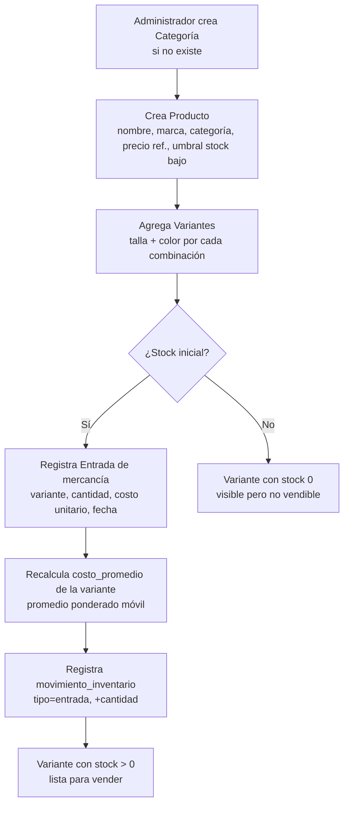
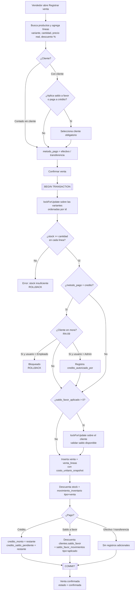
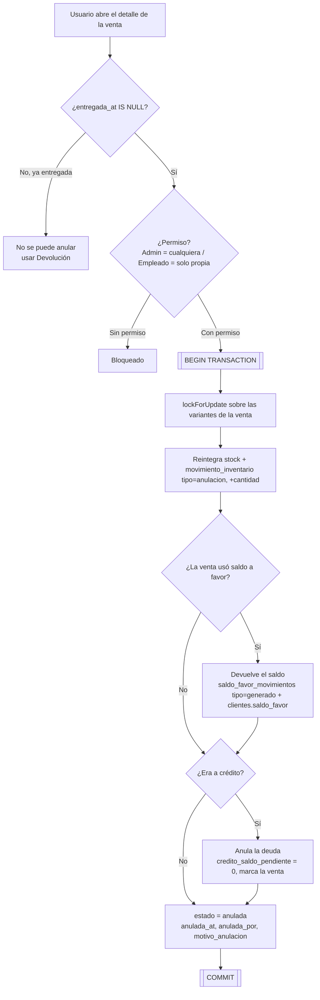
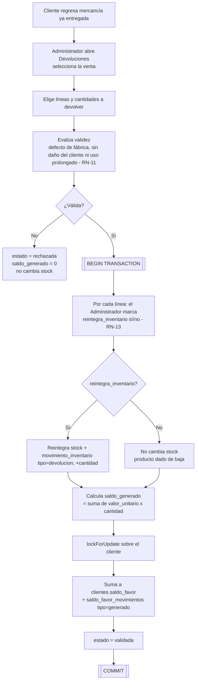
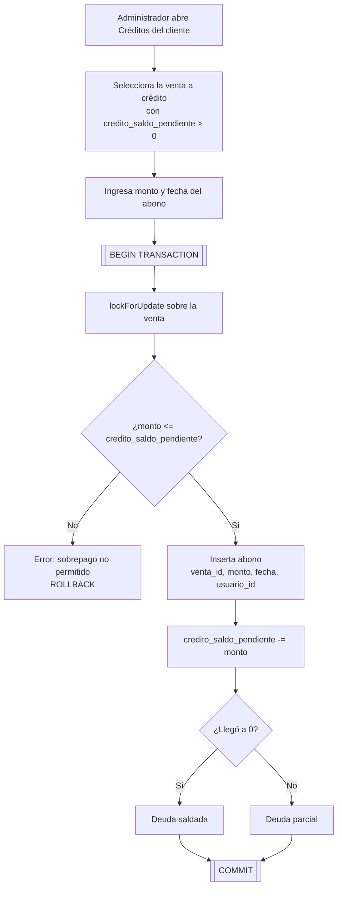
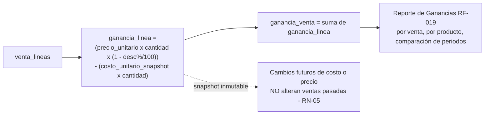

# Diseño Funcional — Sistema JP (Fase 2)

**Versión 1.0** — Agosto de 2026

> Entregable de la Fase 2 del plan de proyecto: árbol de módulos por rol y diagramas de los
> flujos principales del negocio. Traduce los requisitos (`Documento_Requisitos_Software_JP.md`)
> y las decisiones técnicas (`Decisiones_Tecnicas_JP.md`) en pantallas y procesos concretos,
> sin entrar todavía en el detalle visual.

---

## 1. Árbol de módulos — Administrador

```
Administrador
├── Dashboard                         RF-020
│
├── Productos
│   ├── Categorías                    (CRUD; no eliminar con productos activos)
│   ├── Productos                     RF-003
│   │   ├── Crear / Editar / Listar
│   │   ├── Variantes del producto    RF-004  (talla, color, stock, costo)
│   │   └── Historial del producto    RF-016  (solo lectura)
│   └── Inventario
│       ├── Entradas de mercancía     RF-005  (recalcula costo promedio)
│       ├── Ajustes de inventario     RF-006  (RN-10, RN-15)
│       ├── Movimientos               (libro movimientos_inventario, solo lectura)
│       └── Alertas de stock bajo     RF-007  (umbral por producto, RN-14)
│
├── Ventas
│   ├── Registrar venta               RF-008, RF-009, RF-012
│   ├── Listado / Detalle de ventas
│   ├── Anulación (antes de entrega)  RF-010  (reintegra stock)
│   └── Devoluciones (tras entrega)   RF-011  (valida y genera saldo a favor)
│
├── Clientes
│   ├── Clientes                      RF-013
│   ├── Créditos                      RF-014  (deuda por venta, saldo pendiente)
│   ├── Abonos                        RF-014  (parciales, fechados)
│   ├── Control de mora               RF-015  (RN-09, override del Administrador)
│   └── Saldo a favor                 (libro saldo_favor_movimientos, solo lectura)
│
├── Reportes
│   ├── Ventas por periodo            RF-017  (día / semana / mes)
│   ├── Inventario disponible         RF-018
│   └── Ganancias                     RF-019  (por venta y por producto, comparación de periodos)
│
└── Usuarios                          RF-002  (crear, editar, asignar rol)
```

## 2. Árbol de módulos — Empleado / Vendedor

```
Empleado / Vendedor
└── Ventas
    ├── Buscar producto / consultar stock   RN-07  (cantidad exacta por variante)
    ├── Registrar venta                     RF-008, RF-009
    │   ├── Seleccionar variantes y cantidades
    │   ├── Capturar precio real (RN-03) y descuento opcional
    │   ├── Seleccionar método de pago
    │   ├── Aplicar saldo a favor            RF-012  (si hay cliente)   [ver decisión G1]
    │   └── Confirmar (descuenta stock)      RF-009
    ├── Anular venta propia (antes de entrega)  RF-010  [ver decisión G2]
    └── Mis ventas                          (solo las registradas por este usuario, RN-08)
```

**El Empleado NO ve:** Dashboard, Reportes, Productos, Categorías, Inventario, gestión de
Clientes, Créditos, Usuarios. Middleware `EnsureRole` bloquea el acceso (RNF-003).

---

## 3. Decisiones funcionales abiertas (requieren confirmación)

Los requisitos no son explícitos en estos puntos. Recomendación entre corchetes.

| # | Pregunta | Recomendación |
|---|----------|---------------|
| **G1** | ¿Puede el Empleado registrar ventas a **crédito** / usar **saldo a favor** / elegir un **cliente**? | El Empleado **puede seleccionar un cliente existente** y registrar venta a crédito (sujeta al bloqueo por mora, que él no puede saltar) y aplicar saldo a favor. **No puede crear ni editar clientes** — eso queda en el módulo Clientes del Administrador. |
| **G2** | ¿Puede el Empleado **anular** una venta? | Sí, pero **solo ventas registradas por él y aún no entregadas**. El Administrador puede anular cualquiera. |
| **G3** | ¿Puede el Empleado marcar una venta como **entregada**? | Sí. La entrega es una acción operativa del punto de venta, no administrativa. |
| **G4** | ¿Existe un **descuento máximo** que el Empleado puede aplicar sin autorización? | Pendiente de negocio (Requisitos §12). **MVP: sin límite**, se registra el precio real tal cual. Si el negocio define un tope, se añade una validación. |

---

## 4. Flujos principales

### 4.1 Alta de producto hasta que es vendible



### 4.2 Registro y confirmación de una venta



### 4.3 Anulación de una venta (antes de la entrega)



> Nota: si la venta a crédito ya tenía **abonos**, la anulación del MVP los deja registrados y
> genera saldo a favor por el monto abonado (nunca efectivo, RN-11). Confirmar con el negocio
> si este caso puede ocurrir en la práctica antes de la entrega.

### 4.4 Devolución (después de la entrega) y saldo a favor



### 4.5 Abono a una venta a crédito



### 4.6 Cálculo de la ganancia (RN-04)



---

## 5. Trazabilidad módulo → requisito

| Módulo | Requisitos cubiertos |
|--------|----------------------|
| Autenticación / Usuarios | RF-001, RF-002, RNF-003, RNF-007 |
| Categorías / Productos / Variantes | RF-003, RF-004 |
| Historial de producto | RF-016 |
| Entradas de mercancía | RF-005 |
| Ajustes de inventario | RF-006 |
| Alertas de stock bajo | RF-007 |
| Registrar venta / confirmar | RF-008, RF-009 |
| Anulación | RF-010 |
| Devoluciones | RF-011 |
| Saldo a favor | RF-011, RF-012 |
| Clientes | RF-013 |
| Créditos / Abonos | RF-014 |
| Control de mora | RF-015 |
| Reportes | RF-017, RF-018, RF-019 |
| Dashboard | RF-020 |
